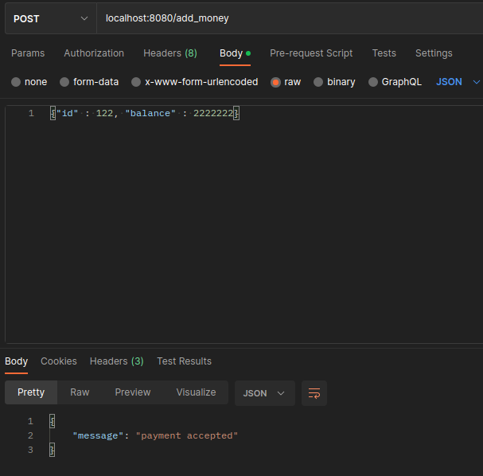
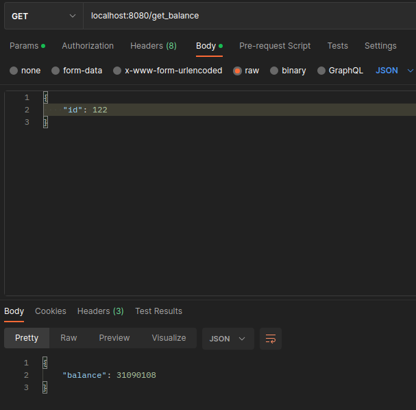
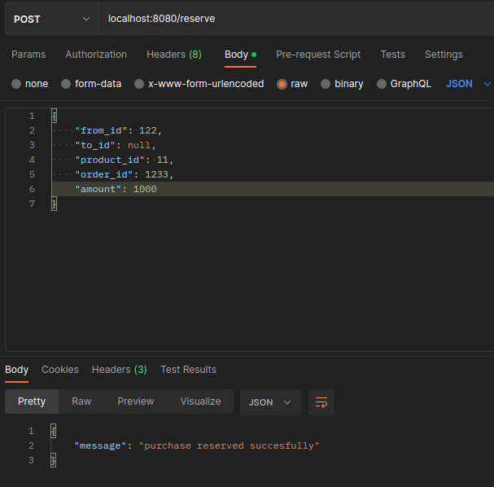
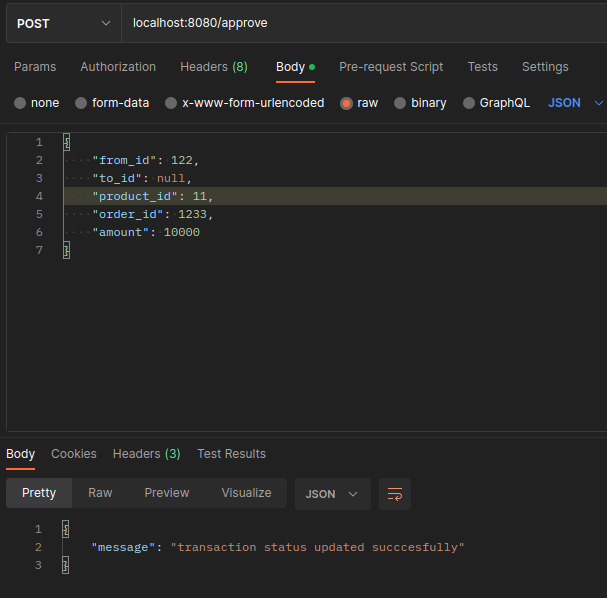

# avito-test-task

## Установка и запуск:
```bash  
git clone https://github.com/ikiselewskii/avito-test-task
cd avito-test-task/
docker-compose build && docker-compose up
```

## Что сделано: 
1. Функция зачисления средств на счет

2. Функция получения баланса пользователя

3. Функция резервирования денег

4. Функция подтверждения транзакции

все денежные суммы указаны в копейках, по-хорошему в реальной задаче у полей order_id, user_id, product_id должен быть тип UUID

## Что стоило бы сделать при правильном распределении времени и сил:
1. Функцию разрезервирования денег с полями как у резервирования/подтверждения, под капотом такая же транзакция как при резервировании но с отменой
2. Юнит-тесты для всех функций в package`е database и utils, это существенно сократило бы время разработки
3. Финансовый отчет с выдачей CSV, селект по таблице с транзакциями где "status" = "accepted"
4. Swagger-документация по эндпоинту /docs
5. Запись пополнений счета в таблицу транзакций в бд(для этого у структуры transaction и соответствующей ей таблицы есть поле type типа smallint, тип для пополнений счёта: 1)
6. Перевод денег от пользователя к пользователю(и запись в транзакции со типом: 2)
7. Github-Actions workflow для автоматического тестирования веток с фичами
## Какие уроки стоит извлечь:
1. Стоит ВСЕГДА(!) писать unit-тесты к сложным, это сильно сокращает время которое уходит на дебаггинг кода 
2. Чтобы стать уверенным go-разработчиком необходимо гораздо больше практики языка, это первое приложение на go масштабнее задачи на литкоде которое я написал 
3. Не стоит откладывать напоследок задачи которые с виду кажутся тривиальными   
4. Не стоит использовать непопулярные библиотеки с недостатком документации
5. Следует заранее оформить boilerplate-репозиторий для REST-API проектов на go с пре-заданными частыми исключениями, пакетом с утилитами, graceful-shutdown логикой и конфигами для db-драйвера и раутера
6. Следует всегда писать комментарии к функциям, даже если работаешь над проектом один
7. При получении тестового задания стоило сразу же полностью посвятить себя ему